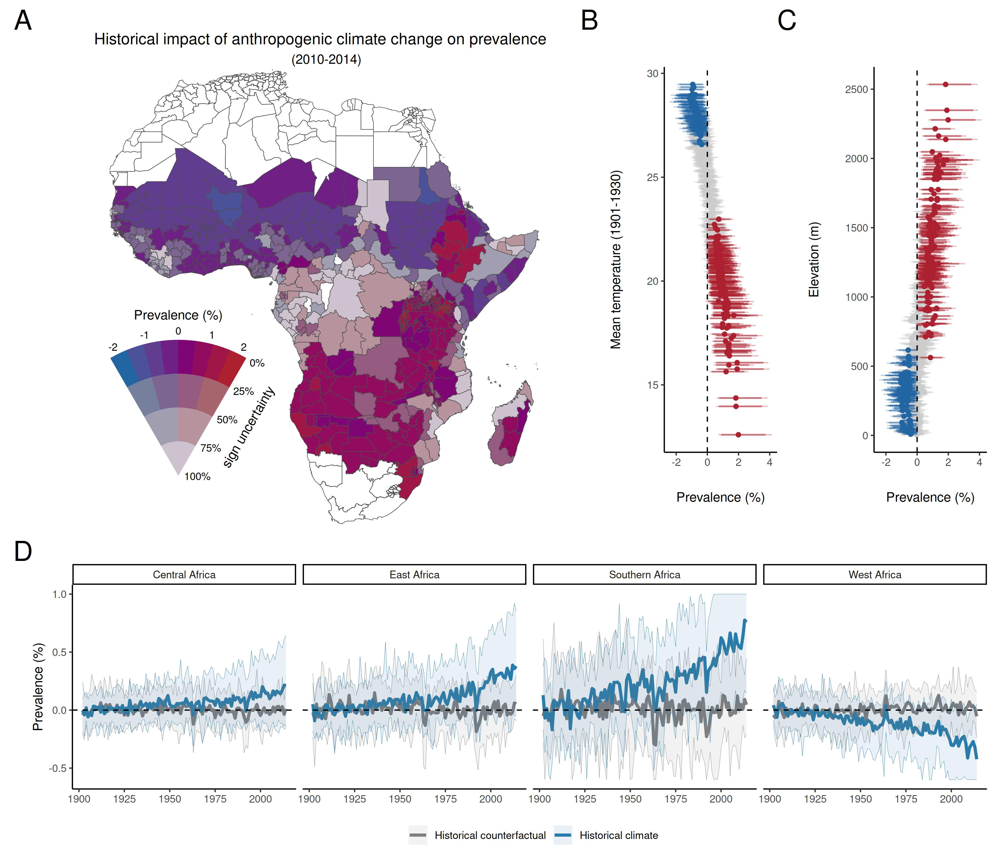

---

This repository contains code for Carlson, Carleton, Odoulami, and Trisos (2022), "**The historical fingerprint and future impact of climate change on childhood malaria in Africa**" (preprint forthcoming on _medRxiv_). Malaria data were previously published by Snow et al. (2017) and are available online; climate data are too large for Github but again available from other sources. 

All R scripts to execute the data analysis and visualization are stored in the Pipeline directory:

```data
📦Pipeline
 ┣ 📂A - Utility functions
 ┃ ┣ 📜A00 - Configuration.R
 ┃ ┣ 📜A01 - Utility code for calculations.R
 ┃ ┣ 📜A02 - Utility code for plotting.R
 ┃ ┗ 📜A03 - Prep data for estimation.R
 ┣ 📂B - Extract climate and prevalence data
 ┃ ┣ 📜B01 - Extract CRU data and temperature for model.R
 ┃ ┣ 📜B02 - Extract GCMs.R
 ┃ ┗ 📜B03 - Generate precipitation key.R
 ┣ 📂C - Model estimation
 ┃ ┣ 📜C01 - MainSpec.R
 ┃ ┗ 📜C02 - Bootstrap.R
 ┣ 📂D - Model sensitivity analyses and checks
 ┃ ┣ 📜D01 - Model sensitivity.R
 ┃ ┗ 📜D02 - Randomization tests.R
 ┣ 📂E - Estimate historical and future prevalence
 ┃ ┣ 📜E01 - Predict prevalence.R
 ┃ ┣ 📜E02 - Prevalence summaries.R
 ┃ ┣ 📜E03 - Extract historical data.R
 ┃ ┣ 📜E04 - Extract future data.R
 ┃ ┣ 📜E05 - Extract historical regionals.R
 ┃ ┗ 📜E06 - Extract future regionals.R
 ┣ 📂F - Figure generation for main text
 ┃ ┣ 📜F01 - Fig1 - Maps.R
 ┃ ┣ 📜F02 - Fig1 - Time series and assembly.R
 ┃ ┣ 📜F03 - Fig2 - Coefficients.R
 ┃ ┣ 📜F04 - Fig2 - Global time series.R
 ┃ ┣ 📜F05 - Fig2 - Assembly.R
 ┃ ┣ 📜F06 - Fig3 - Maps.R
 ┃ ┣ 📜F07 - Fig3 - Elevation and latitude.R
 ┃ ┣ 📜F08 - Fig3 - Time series.R
 ┃ ┣ 📜F09 - Fig3 - Assembly.R
 ┃ ┣ 📜F10 - Fig4 - Maps.R
 ┃ ┣ 📜F11 - Fig4 - Elevation and latitude.R
 ┃ ┣ 📜F12 - Fig4 - Time series.R
 ┃ ┗ 📜F13 - Fig4 - Assembly.R
 ┣ 📂G - Figure generation for supplement
 ┃ ┣ 📜G01 - Visualize thermal curve expectations and data.R
 ┃ ┣ 📜G02 - Historical partials.R
 ┃ ┣ 📜G03 - Future partials.R
 ┃ ┣ 📜G04 - Attributable map.R
 ┃ ┗ 📜G05 - Projections map.R
 ┗ 📂H - Summary statistics for main text
 ┃ ┣ 📜H01 - Thermal responses.R
 ┃ ┣ 📜H02 - Historical summary.R
 ┃ ┣ 📜H03 - Future summary.R
 ┃ ┗ 📜H04 - Global warming levels.R
```
