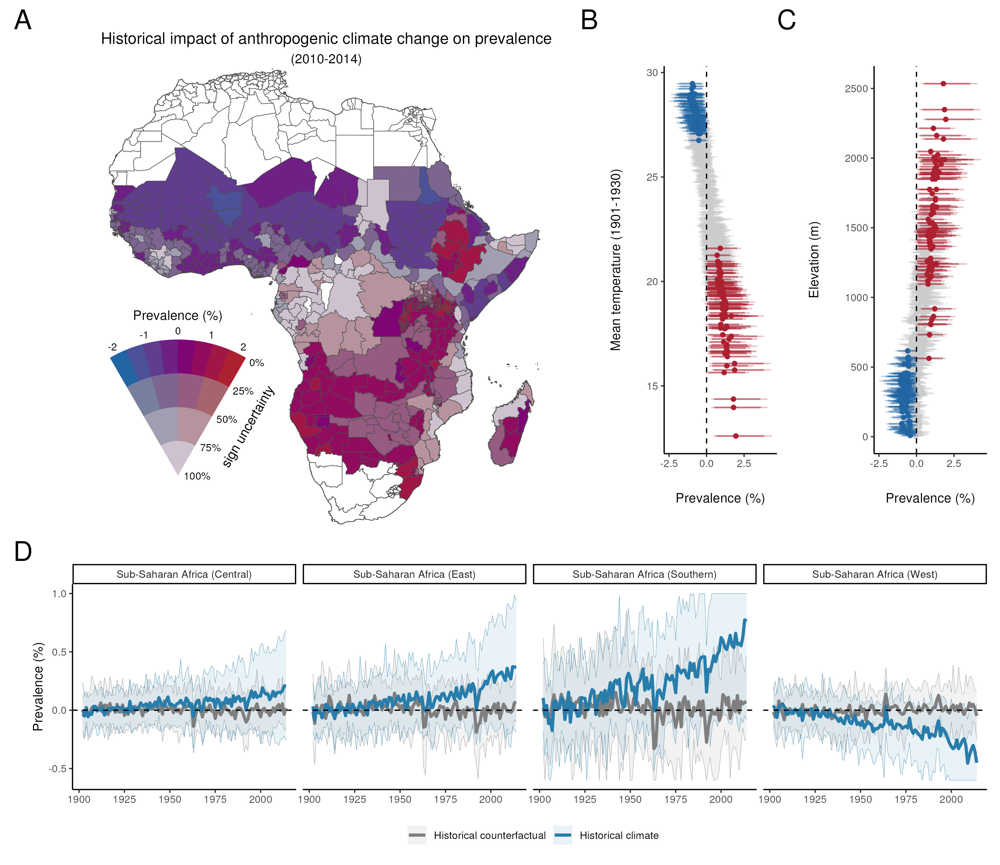

---
# falciparum

This repository contains the code to reproduce the analysis of: 

Carlson, Carleton, Odoulami, Molitor, and Trisos (2026), "**The historical fingerprint and future impact of climate change on childhood malaria in Africa**" [medRxiv preprint](https://www.medrxiv.org/content/10.1101/2023.07.16.23292713v4.full). 

## Data 

All data used in this analysis are freely available online. 

- Malaria data: [Snow, R., Sartorius, B., Kyalo, D. et al. The prevalence of Plasmodium falciparum in sub-Saharan Africa since 1900. Nature 550, 515–518 (2017).](https://doi.org/10.1038/nature24059)
- Climate data: 
  - [Climatic Research Unit gridded time series data version 4.03:](https://crudata.uea.ac.uk/cru/data/hrg/cru_ts_4.03/cruts.1905011326.v4.03/) `tmp` and `pre` data are used. These data are available from 1901-2018. Newer versions of CRU are available, but 4.03 must be used to reproduce this analysis exactly.
  - [Coupled Model Intercomparison Project (CMIP6):](https://cds.climate.copernicus.eu/datasets/projections-cmip6) 
    - The following ten models are used - `ACCESS-CM2`, `ACCESS-ESM1-5`, `BCC-CSM2-MR`, `CanESM5`, `FGOALS-g3`, `GFDL-ESM4`, `IPSL-CM6A-LR`, `MIROC6`, `MRI-ESM2-0`, and `NorESM2-LM` 
    - Under 5 climate scenarios - `historical`, `historical-natural`, `SSP1-2.6`, `SSP2-4.5`, and `SSP5-8.5`
    - **Note:** CMIP6 data have gone through a bias correction procedure to calibrate values to CRU 4.03. Due to this, we provide replication data located at forthcoming.
  - [European Centre for Medium-Range Weather Forecasts Reanalysis v5 (ERA5)](https://cds.climate.copernicus.eu/datasets/reanalysis-era5-single-levels-monthly-means?tab=overview): Monthly averaged data on single levels from 1940 to present.  
- [Global Burden of Disease (GBD) regions](https://www.healthdata.org/research-analysis/gbd): Defines the 4 regions in sub-Saharan Africa used in the analysis.
- [Global Administrative Areas dataset version 3.6](https://gadm.org/download_world36.html): Level one administrative boundaries (ADM1) are used as the primary unit of prevalence and data aggregation. 
- [Global Human Settlement Layer Urban Centre Database GHS-UCDB R2024A](https://human-settlement.emergency.copernicus.eu/ghs_ucdb_2024.php): UCDB defines the boundaries of urban centers and allows us to construct an urban dummy variable for diagnostics. 

The data replication package includes all files needed to reproduce the analysis, but does not include publicly available datsets. These data include:

- CRU temperature and precipitation data files, aggregated to ADM1 boundaries.
- Bias corrected CMIP6 data files, including gridded and ADM1 aggregates.
- Elevation data, aggregated to the ADM1 level.
- Analysis ready data files with malaria prevalence and CRU and ERA5 data at the ADM1 level. An additional file is provided with prevalence data aggregated to the native resolution of CRU. All three files include the variables needed in analysis starting at `Pipeline/C - Model estimation` of the code.

## Code

All R scripts to execute the data analysis and visualization are stored in the Pipeline directory:

```data
Pipeline
├── A - Utility functions
│   ├── A01 - Configuration.R
│   ├── A02 - Utility code for calculations.R
│   └── A03 - Utility code for plotting.R
├── B - Extract climate and prevalence data
│   ├── B01 - Extract CRU tmp and prc data ADM1.R
│   ├── B02 - Extract GCM tmp and prc data ADM1.R
│   ├── B03 - Extract CRU tmp and prc data grid.R
│   ├── B04 - Join prev and CRU data.R
│   ├── B05 - Extract ERA5 tmp and prc data ADM1.R
│   └── B06 - Join prev and ERA5 data.R
├── C - Model estimation
│   ├── C01 - Main specification.R
│   ├── C02 - Bootstrap estimation.R
│   └── C03 - VCOV sampling.R
├── D - Model sensitivity analyses and checks
│   ├── D01 - Model sensitivity.R
│   ├── D02 - Randomization tests.R
│   ├── D03 - Additional robustness.R
│   ├── D04 - Uncertainty analysis.R
│   ├── D04b - newrob.R
│   ├── D05 - High resolution model.R
│   ├── D06 - Urbanization.R
│   └── D07 - ERA5 analysis.R
├── E - Estimate historical and future prevalence
│   └── E01 - Predict prevalence.R
├── F - Figure generation for main text
│   ├── F01 - Prev maps and TS.R
│   ├── F02 - Coeff and TS.R
│   ├── F03 - Hist map, temp, elev, and TS.R
│   └── F04 - Future map, temp, elev, and TS.R
├── G - Figure generation for supplement
│   ├── G01 - Visualize thermal curve expectations and data.R
│   ├── G02 - Historical partials.R
│   ├── G03 - Future partials.R
│   ├── G04 - Attributable map.R
│   ├── G05 - Projection maps.R
│   ├── G06 - Monthly time series.R
│   └── G07 - vcov sample.R
└── H - Summary statistics for main text
    ├── H01 - Thermal responses.R
    ├── H02 - Historical summary.R
    ├── H03 - Future summary.R
    └── H04 - Global warming levels.R
```

## Results

The figures and tables from the paper can be found in `Results` folder.

## How to replicate results:

There are two primary pathways to replication.

1. Full replication, including all data processing, modeling, prediction, and results summaries. This is equivalent to running all sections of the `Pipeline`
2. Analysis replication, including sections `C`, `D`, `F`, and `G`. Section `E` is considered optional due to processing time and compute power needed. The appropriate summary files are provided for sections `F`-`G`.

In both cases, the first steps are the same:
- Download the data replication package located at forthcoming
- Cloning this repository
- Edit the file `A01 - Configuration.R` to include your username on the computer you are using, and the location of the data and code. This means editing two variables `data_dir` and `repo_dir`

Full replication is a higher bar to clear as each user will be responsible for downloading the public data files and for placing them in the appropriate data folder following the outline that is reflected in `A01 - Configuration.R`. Only minimal data processing will be required for the simpler analysis replication pathway. 

The Pipeline can be run at any level a user chooses. It is important to note that there are a few R packages which have become outdated since the beginning of this project and we have therefore created a Docker container [r-malaria-cru](https://hub.docker.com/repository/docker/cmolitor/r-malaria-cru/general) which is able to run the files which require old R versions. These files include:

- `B01 - Extract CRU tmp and prc data ADM1.R` due to the now outdated [velox](https://github.com/hunzikp/velox) package
- `F03 - Hist map, temp, elev, and TS.R` due to the [multiscales](https://github.com/clauswilke/multiscales) package
- `F04 - Future map, temp, elev, and TS.R` due to the [multiscales](https://github.com/clauswilke/multiscales) package

The rest of the code can be run with more recent versions of R. It has most recently been used with R 4.5.2. 

Along with the structured and sequential pipeline, we provide a SLURM orchestration script `run_pipeline.slurm`. This can be used to run each file sequentially on a high performance compute (HPC) cluster node. Parallel processing has been implemented on the script level where needed to speed up overall run time. This script relies on docker containers, which are freely available on Dockerhub including the [r-malaria-cru](https://hub.docker.com/repository/docker/cmolitor/r-malaria-cru/general) and [rocker/geospatial](https://hub.docker.com/r/rocker/geospatial). 

The last complete run of this pipeline took 1 hour and 12 minutes on a single HPC node running an Intel Xeon Gold 6330 processor with 56 cores and 256 GB of RAM. The full data storage requirement with all input data, intermediate data, and output data is XX GB. Running this on a standard desktop computer could incur 1-2 orders of magnitude more run time. The smaller analysis replication on a normal desktop computer will run in approximately 3 hours.

## Use of code and data

Our code can be used, modified, and distributed freely for educational, research, and not-for-profit uses. For all other cases, please contact us. Further details are available in the [license](LICENSE).
